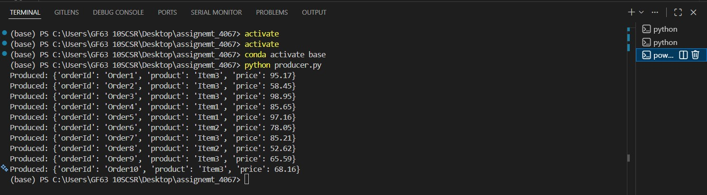
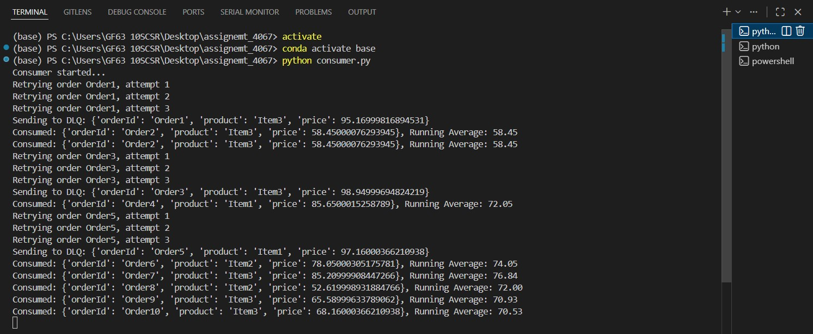
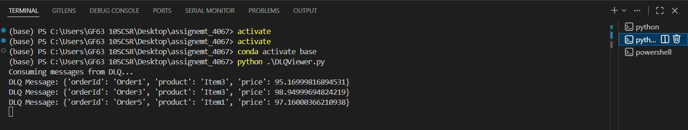

# Kafka Order Processing System

This repository contains a **Python-based Kafka system** that produces and consumes order messages using **Avro serialization**. The system supports:

- Real-time aggregation (running average of prices)  
- Retry logic for temporary failures (3 retries)  
- Dead Letter Queue (DLQ) for permanently failed messages  
- Viewing DLQ messages  

---

# Demonstration
https://github.com/Nipunikumudika/Kafka_Assignemt_4067/blob/main/Demonstration.mp4


## Project Structure

```
kafka_assignment/
│── producer.py # Produces orders to Kafka
│── consumer.py # Consumes orders, calculates running average, retries failed messages, sends to DLQ
│── dlq_viewer.py # Consumes messages from the DLQ
│── order.avsc # Avro schema for order messages
│── requirements.txt # Python dependencies
│── README.md #README file

```


---

# Requirements
- **Python 3.8+**  
- **Kafka + Zookeeper** (Docker recommended)  
- **Schema Registry**

Install dependencies:

```sh
pip install -r requirements.txt
```

# Setup
### Start Kafka + Schema Registry using Docker

```sh
docker compose up -d
```
### Verify containers

```sh
docker ps
```

## Kafka Topics
### Create main topic

```sh
docker exec -it <kafka_container_id> \
kafka-topics --create --topic orders \
--bootstrap-server localhost:9092 --partitions 3 --replication-factor 1

```

### Create DLQ topic

```sh
docker exec -it <kafka_container_id> \
kafka-topics --create --topic orders-dlq \
--bootstrap-server localhost:9092 --partitions 1 --replication-factor 1
```

# Usage
### 1. Start Consumer

```sh
python consumer.py
```

### 2. Start Producer (New Terminal)

```sh
python producer.py
```

### 3. View Dead Letter Queue Messages

```sh
python DLQViewer.py
```

# Features
- *Avro-based serialization*
- *Retry logic (3 attempts per message)*
- *DLQ forwarding for permanent failures*
- *Running average price calculation*
- *Real-time logs printed to console*

# Output
### Producer



### Consumer



### Dead Letter Queue Viewer

